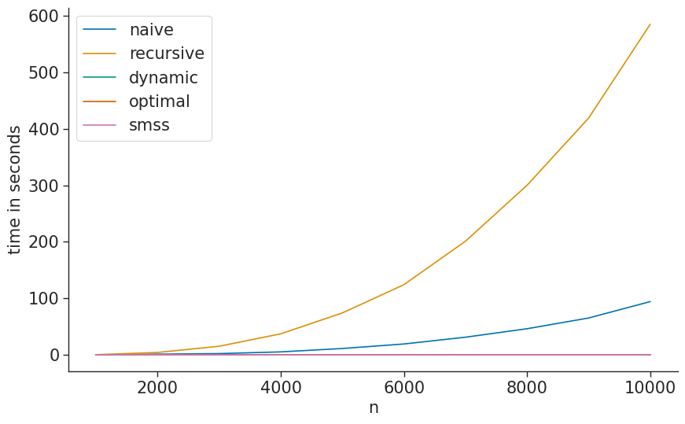

# Maximal Scoring Subsequence

## Usage
This project is contained in one single `jar`. Based on the input parameters
the `jar` reacts in different ways.

```sh
java -jar main.jar [--vec] [--algorithms] [--path] [--sec] [--step] [--size]
```
- `--vec` can be a space separated vector of $n$ values. If not provided, `jar` will switch to **benchmark mode**.
  - `--algorithms` can be any combination of algorithms (space separated) in this set:  
     `{naive, recursive, divide, dynamic, optimal, 2_a, 2_b, 2_c, 2_c_1}`.
     Note that `2_c_1` is also the same algorithm as `2_c` (utilizing) the dynamic programming algorithm, but
     in `2_c_1` we optimized the array usage by only creating as many ints in the arrays as necessary. 
     It is still not optimal, but it works on larger input `n` (see report).
     If not provided, all elements of the set will be executed.
- `--path` can be the name of the csv file, `default=times.csv`.
- `--sec` convert μs into s (in csv out).
- `--step` this flag is used in benchmarking. The input vec of each iteration is 
   increased by this constant per iteration, `default=1`.

> [!NOTE]  
> A csv containing the execution times per algorithm is only created when in `benchmark mode` (meaning no `--v` is passed)

## Run Examples

### Example 1
```sh
java -jar main.jar --v  5 -2 5 -2 1 -9 5 -2 4 -5 1 -2 3 -1 5 -3 2 -1 2 --a naive optimal 
```
Runs `naive` and `optimal` on vector `v`

### Example 2
```sh
java -jar main.jar --a naive optimal dynamic --p test
```
Benchmarks `naive`, `optimal`, `dynamic` and saves time (in microseconds) as `test.csv`

### Example 3
```sh
java -jar main.jar --a naive optimal dynamic --f 300 --s
```
Benchmarks `naive`, `optimal`, `dynamic`, increases input vec by 300 each iteration.
Converts μs in s in `times.csv`

### Example 4
```sh
java -jar main.jar 
```
Benchmarks all

### Example 5
```sh
java -jar main.jar --v 1 2 3 -3 10 1
```
Runs all algorithms on `v`

## Plotting Results
```sh
python3 plot.py -p <name.csv> -m <metric>

```
Saves plot as `<name.png>` and labels y-axis with `<metric>`:  


